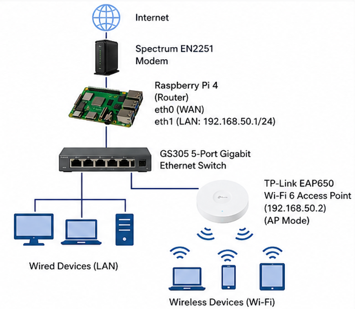
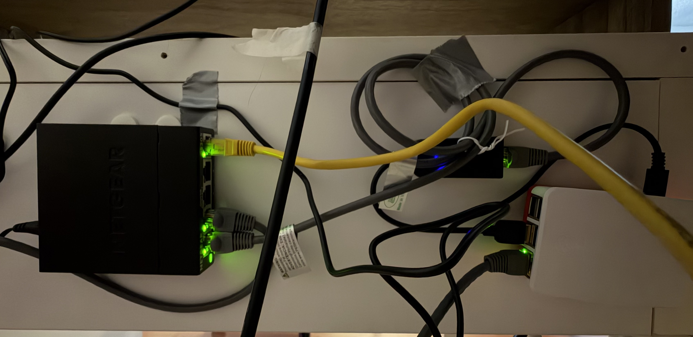

# Raspberry Pi 4 Home Router

A Raspberry Pi 4-based home router designed, configured, and benchmarked as a replacement for an ISP-provided Spectrum router.

This project began as a hands-on engineering exercise to better understand the networking services that allow a home router to function. Rather than relying entirely on ISP-provided hardware, I configured the routing system from the ground up and documented the design, implementation, troubleshooting, validation, and performance testing.

## Final Network Architecture



The final system separates routing, switching, and wireless access into dedicated components:

```text
Internet
   |
Spectrum EN2251 Modem
   |
  eth0
   |
Raspberry Pi 4
   |
  eth1
   |
NETGEAR GS305 Switch
   |              |
Wired Clients   TP-Link EAP650
                      |
                 Wi-Fi Clients
```

The Raspberry Pi performs the Layer 3 routing functions. The GS305 provides Layer 2 Ethernet switching, and the EAP650 bridges wireless clients onto the LAN.

## Project Goals

- Build a functional home router from the ground up
- Understand the purpose of each major routing service rather than only making the system work
- Configure DHCP, DNS, NAT, packet forwarding, and firewalling
- Separate routing, switching, and wireless access into modular components
- Validate configuration persistence across reboots
- Compare the completed system with the original ISP-provided router
- Document the project so the process can be reproduced by others

## Hardware

| Component | Role |
| --- | --- |
| Raspberry Pi 4 Model B | Primary router |
| Cable Matters USB 3.0 Gigabit Ethernet adapter | Second Ethernet interface for LAN |
| NETGEAR GS305 5-Port Gigabit Ethernet Switch | Layer 2 LAN switching |
| TP-Link Omada EAP650 Wi-Fi 6 Access Point | Wireless access |
| Spectrum EN2251 Modem | ISP modem |
| Raspberry Pi case, fan, and heatsink | Cooling and enclosure |
| 128 GB microSD card | Raspberry Pi OS storage |
| Cat6 Ethernet cabling | Network interconnects |

## Software and Tools

- Raspberry Pi OS 64-bit
- NetworkManager / `nmcli`
- `dnsmasq`
- `nftables`
- Linux `ip` networking utilities
- `systemctl`
- `journalctl`
- SSH
- Speedtest

## Router Functions

The Raspberry Pi is responsible for:

- **DHCP** — assigns IP addresses and network configuration to LAN clients
- **DNS** — forwards and caches DNS requests through `dnsmasq`
- **Packet forwarding** — routes traffic between LAN and WAN interfaces
- **NAT masquerading** — translates private LAN addresses for Internet access
- **Stateful firewalling** — permits outbound LAN traffic and established/related return traffic
- **Interface management** — maintains separate WAN and LAN network interfaces
- **Persistent configuration** — restores routing, firewall, and network services after reboot

## Network Addressing

| Interface / Device | Role | Address |
| --- | --- | --- |
| `eth0` | WAN | Assigned dynamically by ISP |
| `eth1` | Raspberry Pi LAN | `192.168.50.1/24` |
| EAP650 | Access point management | `192.168.50.2` |
| LAN clients | DHCP pool | `192.168.50.100–192.168.50.199` |

The private `192.168.50.0/24` LAN was selected so it would not overlap with the original `192.168.1.0/24` network used during setup.

## Configuration Files

Sanitized versions of the primary router configuration files are included in [`config/`](config/):

| File | Purpose |
| --- | --- |
| [`dnsmasq.conf`](config/dnsmasq.conf) | DHCP, DNS forwarding, caching, and AP reservation |
| [`nftables.conf`](config/nftables.conf) | Stateful forwarding, firewall rules, and NAT masquerading |
| [`99-pi-router.conf`](config/99-pi-router.conf) | Persistent IPv4 forwarding |

Public IP addresses, credentials, MAC addresses, and personally identifying network information are excluded or replaced with example values.

## Performance Testing

The completed Raspberry Pi system was benchmarked against the original Spectrum router using paired wired and wireless Speedtest measurements.

Testing used:

- The same Speedtest server
- The same wireless client
- Ten paired measurements per test location
- Alternating wired and wireless tests to reduce time-dependent ISP/server variation
- Three wireless locations with increasing distance and obstruction

### Wired Download Throughput

| Test Location | Raspberry Pi | Spectrum |
| --- | ---: | ---: |
| Ideal | 544.3 Mbps | 537.1 Mbps |
| Living Room | 546.6 Mbps | 538.2 Mbps |
| Bedroom | 548.7 Mbps | 543.7 Mbps |

The Raspberry Pi matched or slightly exceeded the Spectrum router's wired throughput while maintaining full use of the 500 Mbps Internet service.

The largest wired difference appeared in loaded latency. Raspberry Pi upload-loaded latency averaged approximately **7.9 ms**, while the Spectrum router recorded approximately **188–203 ms** during the same class of testing.

### Wireless Download Throughput

| Test Location | Raspberry Pi + EAP650 | Spectrum |
| --- | ---: | ---: |
| Ideal (~3 ft) | 535.9 Mbps | 534.7 Mbps |
| Living Room (~16 ft, line of sight) | 465.5 Mbps | 488.1 Mbps |
| Bedroom (~20 ft, obstructed) | 330.4 Mbps | 425.2 Mbps |

Under ideal conditions, the two wireless systems performed nearly identically.

As distance and obstruction increased, the Spectrum router retained more raw wireless throughput. The EAP650, however, produced lower download-throughput variability in the living room and bedroom tests.

This became one of the main lessons of the project: **routing performance and wireless performance should be evaluated separately.** The Raspberry Pi routing layer remained consistent while the access point and RF environment became the primary variables in the wireless tests.

## Thermal Performance

The Raspberry Pi remained thermally stable during sustained Speedtest traffic.

| Test Location | Average Wired Temperature | Average Wireless Temperature |
| --- | ---: | ---: |
| Ideal | 44.02 °C | 42.95 °C |
| Living Room | 43.80 °C | 43.10 °C |
| Bedroom | 44.55 °C | 44.19 °C |

No comparable internal temperature telemetry was available from the Spectrum router.

## Benchmark Data

Both the original measurements and the formatted summary are included in [`results/`](results/):

- [Raw Benchmarking Data](results/Raspberry%20Router%20Benchmarking.xlsx)
- [Benchmarking Summary](results/Raspberry%20Router%20Benchmarking%20Summary.xlsx)

Keeping the raw measurements alongside the summary makes the reported averages, standard deviations, and conclusions independently inspectable.

## Full Lab Guide

The complete 31-page project guide documents:

- Network architecture and addressing
- Raspberry Pi preparation
- LAN interface configuration
- DHCP and DNS
- Packet forwarding and NAT
- Stateful `nftables` firewall configuration
- EAP650 integration and DHCP reservation
- Temporary Wi-Fi uplink and final WAN cutover
- Reboot and persistence validation
- Troubleshooting methods
- Wired and wireless benchmarking
- Thermal testing
- Command reference
- Client-side network validation

**[View the complete Raspberry Pi Router v1.0 Lab Guide](documentation/Raspberry-Pi-Router-v1.0.pdf)**

## Physical Build

<p align="center">
  
  
</p>

## Repository Structure

```text
raspberry-pi-router/
├── README.md
├── LICENSE
├── config/
│   ├── 99-pi-router.conf
│   ├── dnsmasq.conf
│   └── nftables.conf
├── documentation/
│   └── Raspberry-Pi-Router-v1.0.pdf
├── images/
│   ├── eap650.jpeg
│   ├── final-topology.png
│   └── raspberry-pi-and-switch.jpeg
└── results/
    ├── Raspberry Router Benchmarking.xlsx
    └── Raspberry Router Benchmarking Summary.xlsx
```

## Key Takeaways

This project provided hands-on experience with:

- Linux networking and interface management
- DHCP and DNS services
- Routing tables and default gateways
- Network Address Translation
- Stateful firewall rules
- Packet forwarding
- Network troubleshooting
- DHCP reservations and client identifiers
- Wireless access point integration
- Controlled performance benchmarking
- Separating routing performance from RF/wireless performance
- Writing reproducible technical documentation

The completed build demonstrated that a Raspberry Pi 4 can function as a practical home routing platform without introducing a meaningful wired throughput bottleneck for a 500 Mbps Internet connection.

## Disclaimer

This project was developed for educational and personal networking use. ISP requirements, interface names, hardware behavior, and network environments may differ between systems.

Review all network, firewall, and security settings before deploying a similar configuration.

## License

This repository is licensed under the [MIT License](LICENSE).
